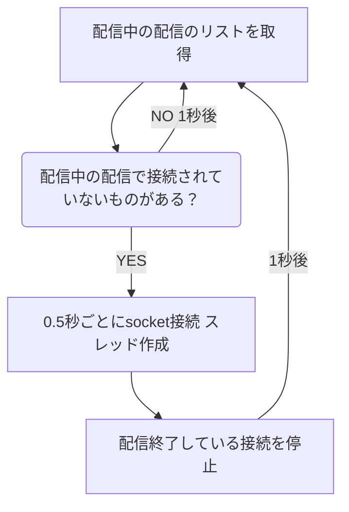

## 接続リスト作成bot

```mermaid
flowchart TD
    A[配信中の配信のリストを取得] --> B(配信中の配信で接続されていないものがある？)
    B --NO 1秒後--> A
    B --YES--> C[0.5秒ごとにsocket接続 スレッド作成]
    C --> D[配信終了している接続を停止]
    D --1秒後--> A
```
