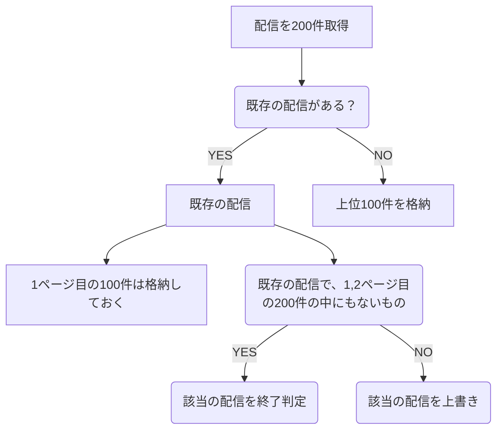

```mermaid
flowchart TD
    A[配信を200件取得] --> B(既存の配信がある？)
    B -- YES --> C[既存の配信]
    B -- NO --> 上位100件を格納
    C --> 1ページ目の100件は格納しておく
    C --> D(既存の配信で、1,2ページ目の200件の中にもないもの)
    D -- YES --> E(該当の配信を終了判定)
    D -- NO --> F(該当の配信を上書き)
```
